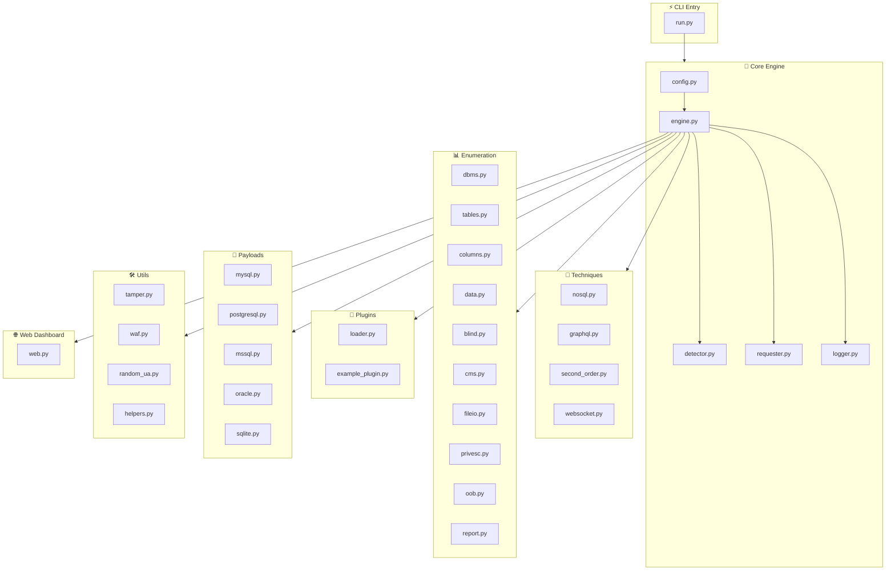

<div align="center">

```ascii
                                                                                      
 ____    ____       _____    _____      _____  _____   ______  _____   ______         
|    |  |    |  ___|\    \  |\    \    /    /||\    \ |\     \|\    \ |\     \        
|    |  |    | |    |\    \ | \    \  /    / | \\    \| \     \\\    \| \     \       
|    | /    // |    | |    ||  \____\/    /  /  \|    \  \     |\|    \  \     |      
|    |/ _ _//  |    |/____/  \ |    /    /  /    |     \  |    | |     \  |    |      
|    |\    \'  |    |\    \   \|___/    /  /     |      \ |    | |      \ |    |      
|    | \    \  |    | |    |      /    /  /      |    |\ \|    | |    |\ \|    |      
|____|  \____\ |____| |____|     /____/  /       |____||\_____/| |____||\_____/|      
|    |   |    ||    | |    |    |`    | /        |    |/ \|   || |    |/ \|   ||      
|____|   |____||____| |____|    |_____|/         |____|   |___|/ |____|   |___|/      
  \(       )/    \(     )/         )/              \(       )/     \(       )/        
   '       '      '     '          '                '       '       '       '         
                                                                                      
                                                                                      
 _________________      ______         _____        ______  _______                   
/                 \ ___|\     \    ___|\    \      |      \/       \                  
\______     ______/|     \     \  /    /\    \    /          /\     \                 
   \( /    /  )/   |     ,_____/||    |  |    |  /     /\   / /\     |                
    ' |   |   '    |     \--'\_|/|    |__|    | /     /\ \_/ / /    /|                
      |   |        |     /___/|  |    .--.    ||     |  \|_|/ /    / |                
     /   //        |     \____|\ |    |  |    ||     |       |    |  |                
    /___//         |____ '     /||____|  |____||\____\       |____|  /                
   |`   |          |    /_____/ ||    |  |    || |    |      |    | /                 
   |____|          |____|     | /|____|  |____| \|____|      |____|/                  
     \(              \( |_____|/   \(      )/      \(          )/                     
      '               '    )/       '      '        '          '                      
                           '                                                          
```

<br>

# **Injecta**

### _SQL Injection Automation Framework — Detection → Extraction → Exfiltration_

<br>

**Zero web dependencies · 6 DBMS backends · 5 injection techniques · 19 WAF tamper scripts · Plugin system**

<br>

---

<br>

</div>

<div align="center">

<!-- Feature badges row -->
<span style="display:inline-block;background:#1a1a2e;color:#e94560;padding:8px 20px;border-radius:20px;margin:4px;font-weight:bold;border:1px solid #e94560;">⬡ BLIND OPTIMIZER</span>
<span style="display:inline-block;background:#1a1a2e;color:#e94560;padding:8px 20px;border-radius:20px;margin:4px;font-weight:bold;border:1px solid #e94560;">⬡ CMS FINGERPRINT</span>
<span style="display:inline-block;background:#1a1a2e;color:#e94560;padding:8px 20px;border-radius:20px;margin:4px;font-weight:bold;border:1px solid #e94560;">⬡ SECOND-ORDER</span>
<span style="display:inline-block;background:#1a1a2e;color:#e94560;padding:8px 20px;border-radius:20px;margin:4px;font-weight:bold;border:1px solid #e94560;">⬡ WEBSOCKET</span>
<span style="display:inline-block;background:#1a1a2e;color:#e94560;padding:8px 20px;border-radius:20px;margin:4px;font-weight:bold;border:1px solid #e94560;">⬡ PLUGINS</span>
<span style="display:inline-block;background:#1a1a2e;color:#e94560;padding:8px 20px;border-radius:20px;margin:4px;font-weight:bold;border:1px solid #e94560;">⬡ OOB EXFIL</span>
<span style="display:inline-block;background:#1a1a2e;color:#e94560;padding:8px 20px;border-radius:20px;margin:4px;font-weight:bold;border:1px solid #e94560;">⬡ PRIVESC</span>

<br><br>

</div>

<!-- ============================================================ -->
<!-- ARCHITECTURE GRAPH                                            -->
<!-- ============================================================ -->

## **`▸` Architecture**

<br>

<div align="center">



</div>

<br><br>

<!-- ============================================================ -->
<!-- QUICK START                                                   -->
<!-- ============================================================ -->

## **`▸` Quick start**

<br>

```bash
# Clone & install (3 dependencies only)
git clone https://github.com/krynn/injecta.git
cd injecta
pip install -r injecta/requirements.txt

# Scan a target
python run.py -u "http://testphp.vulnweb.com/artists.php?artist=1"
```

<br>

<!-- ============================================================ -->
<!-- LAUNCH METHODS                                                -->
<!-- ============================================================ -->

## **`▸` Launch modes**

<br>

<div align="center">

<table style="width:100%;max-width:800px;background:#0d0d1a;border-radius:16px;border:1px solid #2a2a4a;box-shadow:0 8px 32px rgba(0,0,0,0.4);">
<tr>
<td style="padding:28px;width:33%;text-align:center;border:none;border-right:1px solid #2a2a4a;">
<div style="font-size:42px;margin-bottom:8px;">🖥️</div>
<div style="font-size:18px;font-weight:bold;color:#e94560;">CLI</div>
<div style="font-size:13px;color:#8888aa;margin-top:8px;">Direct scanning</div>
<div style="font-size:12px;color:#666688;margin-top:4px;">`python run.py -u URL`</div>
</td>
<td style="padding:28px;width:33%;text-align:center;border:none;border-right:1px solid #2a2a4a;">
<div style="font-size:42px;margin-bottom:8px;">🌐</div>
<div style="font-size:18px;font-weight:bold;color:#e94560;">Dashboard</div>
<div style="font-size:13px;color:#8888aa;margin-top:8px;">Browser UI + REST API</div>
<div style="font-size:12px;color:#666688;margin-top:4px;">`python run.py --web`</div>
</td>
<td style="padding:28px;width:33%;text-align:center;border:none;">
<div style="font-size:42px;margin-bottom:8px;">💬</div>
<div style="font-size:18px;font-weight:bold;color:#e94560;">REPL</div>
<div style="font-size:13px;color:#8888aa;margin-top:8px;">Interactive console</div>
<div style="font-size:12px;color:#666688;margin-top:4px;">`--interactive`</div>
</td>
</tr>
</table>

</div>

<br><br>

<!-- ============================================================ -->
<!-- CLI REFERENCE - THE BIG TABLE                                 -->
<!-- ============================================================ -->

## **`▸` CLI reference**

<br>

<details open>
<summary style="font-size:18px;font-weight:bold;cursor:pointer;color:#e94560;">🎯 Target & request</summary>

<br>

| Flag | Description | Default |
|---|---|---|
| `-u, --url` | Target URL | — |
| `-m, --method` | HTTP method (`GET` / `POST`) | `GET` |
| `-d, --data` | POST data body | — |
| `--cookie` | HTTP cookies | — |
| `-H, --header` | Custom headers (repeatable) | — |
| `--proxy` | Proxy URL (e.g. `http://127.0.0.1:8080`) | — |
| `--tor` | Use Tor SOCKS proxy | `false` |
| `--threads` | Thread count | `1` |
| `--delay` | Delay between requests (seconds) | `0` |
| `--timeout` | Request timeout (seconds) | `10` |
| `--retries` | Max retries | `3` |
| `--random-agent` | Random User-Agent per request | `true` |

</details>

<br>

<details>
<summary style="font-size:18px;font-weight:bold;cursor:pointer;color:#e94560;">💉 Injection control</summary>

<br>

| Flag | Description | Default |
|---|---|---|
| `--dbms` | Force DBMS: `mysql`, `postgresql`, `mssql`, `oracle`, `sqlite`, `auto` | `auto` |
| `--technique` | Techniques: `B`oolean `E`rror `U`nion `T`ime `S`tacked | `BEUST` |
| `--level` | Test intensity (1–5) | `1` |
| `--risk` | Payload risk (1–3) | `1` |

</details>

<br>

<details>
<summary style="font-size:18px;font-weight:bold;cursor:pointer;color:#e94560;">📊 Enumeration</summary>

<br>

| Flag | Description |
|---|---|
| `--dbs` | Enumerate databases |
| `--tables` | Enumerate tables |
| `--columns` | Enumerate columns |
| `--dump` | Dump data |
| `-D, --db` | Target database |
| `-T, --table` | Target table |
| `-C, --column` | Target column(s) |
| `--search` | Search columns/tables |
| `--query` | Run raw SQL query |

</details>

<br>

<details>
<summary style="font-size:18px;font-weight:bold;cursor:pointer;color:#e94560;">📁 File & OS operations</summary>

<br>

| Flag | Description |
|---|---|
| `--file-read <path>` | Read file from DB server |
| `--file-write <path>` | Write file to DB server |
| `--file-write-content <str>` | Content for file write |
| `--file-write-local <path>` | Local file to upload |
| `--os-cmd <cmd>` | Execute OS command |

</details>

<br>

<details>
<summary style="font-size:18px;font-weight:bold;cursor:pointer;color:#e94560;">🧪 Advanced scans</summary>

<br>

| Flag | Description |
|---|---|
| `--nosql` | NoSQL injection (MongoDB, CouchDB) |
| `--graphql` | GraphQL introspection + injection |
| `--privesc` | Privilege escalation detection |
| `--oob-host <host>` | OOB exfiltration target (DNS/HTTP/SMB) |
| `--cms` | CMS fingerprinting |
| `--second-order` | Second-order SQL injection |
| `--ws` | WebSocket scanning |
| `--plugins` | Load custom payload plugins |

</details>

<br>

<details>
<summary style="font-size:18px;font-weight:bold;cursor:pointer;color:#e94560;">📤 Output & mode</summary>

<br>

| Flag | Description | Default |
|---|---|---|
| `--report` | Generate HTML + JSON report | `false` |
| `--web` | Launch web dashboard | `false` |
| `--api` | Headless REST API mode | `false` |
| `--interactive` | Interactive REPL | `false` |
| `--web-port` | Dashboard/API port | `8080` |
| `-v` | Verbosity (repeat: `-v`, `-vv`, `-vvv`) | `0` |
| `-o, --output-dir` | Output directory | `./reports` |
| `--batch` | Never prompt for input | `false` |
| `--flush` | Clear cached results | `false` |
| `--no-color` | Disable colored output | `false` |

</details>

<br><br>

<!-- ============================================================ -->
<!-- DETECTION CAPABILITIES - SVG BAR CHART                        -->
<!-- ============================================================ -->

## **`▸` Detection capabilities**

<br>

<div align="center">

<!-- Detection techniques graph -->
<svg width="700" height="320" viewBox="0 0 700 320" xmlns="http://www.w3.org/2000/svg" style="background:#0d0d1a;border-radius:16px;border:1px solid #2a2a4a;padding:20px;">
  <style>
    .bar { transition: all 0.3s; }
    .bar:hover { opacity: 0.8; }
    .label { fill: #c0c0d0; font-family: monospace; font-size: 13px; }
    .val { fill: #e94560; font-family: monospace; font-size: 12px; font-weight: bold; }
  </style>

  <!-- Grid lines -->
  <line x1="60" y1="40" x2="60" y2="260" stroke="#2a2a4a" stroke-width="1"/>
  <line x1="60" y1="260" x2="680" y2="260" stroke="#2a2a4a" stroke-width="1"/>
  <line x1="60" y1="84" x2="680" y2="84" stroke="#1a1a30" stroke-width="1" stroke-dasharray="4,4"/>
  <line x1="60" y1="128" x2="680" y2="128" stroke="#1a1a30" stroke-width="1" stroke-dasharray="4,4"/>
  <line x1="60" y1="172" x2="680" y2="172" stroke="#1a1a30" stroke-width="1" stroke-dasharray="4,4"/>
  <line x1="60" y1="216" x2="680" y2="216" stroke="#1a1a30" stroke-width="1" stroke-dasharray="4,4"/>

  <!-- Boolean -->
  <rect class="bar" x="70" y="100" width="50" height="160" rx="4" fill="#e94560" opacity="0.85"/>
  <text x="95" y="90" text-anchor="middle" class="val">95%</text>
  <text x="95" y="280" text-anchor="middle" class="label">Boolean</text>

  <!-- Time -->
  <rect class="bar" x="155" y="130" width="50" height="130" rx="4" fill="#e94560" opacity="0.75"/>
  <text x="180" y="120" text-anchor="middle" class="val">85%</text>
  <text x="180" y="280" text-anchor="middle" class="label">Time</text>

  <!-- Error -->
  <rect class="bar" x="240" y="70" width="50" height="190" rx="4" fill="#e94560" opacity="0.9"/>
  <text x="265" y="60" text-anchor="middle" class="val">98%</text>
  <text x="265" y="280" text-anchor="middle" class="label">Error</text>

  <!-- Union -->
  <rect class="bar" x="325" y="60" width="50" height="200" rx="4" fill="#e94560" opacity="0.95"/>
  <text x="350" y="50" text-anchor="middle" class="val">99%</text>
  <text x="350" y="280" text-anchor="middle" class="label">UNION</text>

  <!-- Stacked -->
  <rect class="bar" x="410" y="110" width="50" height="150" rx="4" fill="#e94560" opacity="0.7"/>
  <text x="435" y="100" text-anchor="middle" class="val">80%</text>
  <text x="435" y="280" text-anchor="middle" class="label">Stacked</text>

  <!-- NoSQL -->
  <rect class="bar" x="495" y="130" width="50" height="130" rx="4" fill="#0f3460" opacity="0.85"/>
  <text x="520" y="120" text-anchor="middle" class="val">85%</text>
  <text x="520" y="280" text-anchor="middle" class="label">NoSQL</text>

  <!-- GraphQL -->
  <rect class="bar" x="580" y="150" width="50" height="110" rx="4" fill="#0f3460" opacity="0.8"/>
  <text x="605" y="140" text-anchor="middle" class="val">75%</text>
  <text x="605" y="280" text-anchor="middle" class="label">GraphQL</text>

  <!-- Title -->
  <text x="350" y="310" text-anchor="middle" fill="#666688" font-family="monospace" font-size="11px">Detection confidence by technique</text>
</svg>

</div>

<br><br>

<!-- ============================================================ -->
<!-- DBMS SUPPORT - SVG DONUT CHART                                -->
<!-- ============================================================ -->

## **`▸` DBMS support**

<br>

<div align="center">

<svg width="500" height="320" viewBox="0 0 500 320" xmlns="http://www.w3.org/2000/svg" style="background:#0d0d1a;border-radius:16px;border:1px solid #2a2a4a;padding:20px;">
  <style>
    .dlegend { font-family: monospace; font-size: 13px; fill: #c0c0d0; }
    .dtag { font-family: monospace; font-size: 11px; fill: #8888aa; }
  </style>

  <!-- Donut chart - 5 segments -->
  <!-- MySQL 36% -> 129.6 deg -->
  <circle cx="160" cy="160" r="90" fill="none" stroke="#e94560" stroke-width="30" stroke-dasharray="226 629" stroke-dashoffset="0" transform="rotate(-90 160 160)" opacity="0.85"/>
  <!-- PostgreSQL 24% -> 86.4 deg -->
  <circle cx="160" cy="160" r="90" fill="none" stroke="#0f3460" stroke-width="30" stroke-dasharray="150 629" stroke-dashoffset="-226" transform="rotate(-90 160 160)" opacity="0.85"/>
  <!-- MSSQL 18% -> 64.8 deg -->
  <circle cx="160" cy="160" r="90" fill="none" stroke="#533483" stroke-width="30" stroke-dasharray="113 629" stroke-dashoffset="-376" transform="rotate(-90 160 160)" opacity="0.85"/>
  <!-- Oracle 14% -> 50.4 deg -->
  <circle cx="160" cy="160" r="90" fill="none" stroke="#16213e" stroke-width="30" stroke-dasharray="88 629" stroke-dashoffset="-489" transform="rotate(-90 160 160)" opacity="0.85"/>
  <!-- SQLite 8% -> 28.8 deg -->
  <circle cx="160" cy="160" r="90" fill="none" stroke="#1a1a2e" stroke-width="30" stroke-dasharray="50 629" stroke-dashoffset="-577" transform="rotate(-90 160 160)" opacity="0.85"/>

  <!-- Center text -->
  <text x="160" y="155" text-anchor="middle" fill="#e94560" font-family="monospace" font-size="22" font-weight="bold">6</text>
  <text x="160" y="175" text-anchor="middle" fill="#8888aa" font-family="monospace" font-size="11">DBMS</text>

  <!-- Legend -->
  <rect x="300" y="80" width="14" height="14" rx="3" fill="#e94560" opacity="0.85"/>
  <text x="322" y="93" class="dlegend">MySQL</text>
  <text x="420" y="93" class="dtag">(36% payloads)</text>

  <rect x="300" y="110" width="14" height="14" rx="3" fill="#0f3460" opacity="0.85"/>
  <text x="322" y="123" class="dlegend">PostgreSQL</text>
  <text x="420" y="123" class="dtag">(24% payloads)</text>

  <rect x="300" y="140" width="14" height="14" rx="3" fill="#533483" opacity="0.85"/>
  <text x="322" y="153" class="dlegend">MSSQL</text>
  <text x="420" y="153" class="dtag">(18% payloads)</text>

  <rect x="300" y="170" width="14" height="14" rx="3" fill="#16213e" opacity="0.85"/>
  <text x="322" y="183" class="dlegend">Oracle</text>
  <text x="420" y="183" class="dtag">(14% payloads)</text>

  <rect x="300" y="200" width="14" height="14" rx="3" fill="#1a1a2e" opacity="0.85"/>
  <text x="322" y="213" class="dlegend">SQLite</text>
  <text x="420" y="213" class="dtag">(8% payloads)</text>
</svg>

</div>

<br><br>

<!-- ============================================================ -->
<!-- FEATURES GRID                                                  -->
<!-- ============================================================ -->

## **`▸` Features**

<br>

<div align="center">

<!-- Row 1 -->
<table style="width:100%;max-width:900px;border-collapse:separate;border-spacing:8px;">
<tr>

<td style="background:#0d0d1a;border-radius:14px;border:1px solid #2a2a4a;padding:22px;width:33%;vertical-align:top;">
<div style="font-size:28px;margin-bottom:6px;">🔍</div>
<div style="font-size:15px;font-weight:bold;color:#e94560;margin-bottom:6px;">Injection detection</div>
<div style="font-size:12px;color:#8888aa;line-height:1.6;">
Boolean · Time · Error · UNION · Stacked<br>
Auto-detection with DBMS-specific payloads
</div>
</td>

<td style="background:#0d0d1a;border-radius:14px;border:1px solid #2a2a4a;padding:22px;width:33%;vertical-align:top;">
<div style="font-size:28px;margin-bottom:6px;">🧩</div>
<div style="font-size:15px;font-weight:bold;color:#e94560;margin-bottom:6px;">Blind optimizer</div>
<div style="font-size:12px;color:#8888aa;line-height:1.6;">
Binary search + bitwise extraction<br>
~7 req/char vs ~95 req/char naive
</div>
</td>

<td style="background:#0d0d1a;border-radius:14px;border:1px solid #2a2a4a;padding:22px;width:33%;vertical-align:top;">
<div style="font-size:28px;margin-bottom:6px;">🌐</div>
<div style="font-size:15px;font-weight:bold;color:#e94560;margin-bottom:6px;">CMS fingerprint</div>
<div style="font-size:12px;color:#8888aa;line-height:1.6;">
WordPress · Joomla · Drupal · Magento · phpMyAdmin<br>
Version detection + exploit mapping
</div>
</td>

</tr>
</table>

<!-- Row 2 -->
<table style="width:100%;max-width:900px;border-collapse:separate;border-spacing:8px;">
<tr>

<td style="background:#0d0d1a;border-radius:14px;border:1px solid #2a2a4a;padding:22px;width:33%;vertical-align:top;">
<div style="font-size:28px;margin-bottom:6px;">🔄</div>
<div style="font-size:15px;font-weight:bold;color:#e94560;margin-bottom:6px;">Second-order</div>
<div style="font-size:12px;color:#8888aa;line-height:1.6;">
5 stored-injection scenarios<br>
Register · Comments · Search · Contact · Reviews
</div>
</td>

<td style="background:#0d0d1a;border-radius:14px;border:1px solid #2a2a4a;padding:22px;width:33%;vertical-align:top;">
<div style="font-size:28px;margin-bottom:6px;">🔌</div>
<div style="font-size:15px;font-weight:bold;color:#e94560;margin-bottom:6px;">WebSocket scanner</div>
<div style="font-size:12px;color:#8888aa;line-height:1.6;">
Endpoint discovery (page + guess)<br>
Raw masked frame injection
</div>
</td>

<td style="background:#0d0d1a;border-radius:14px;border:1px solid #2a2a4a;padding:22px;width:33%;vertical-align:top;">
<div style="font-size:28px;margin-bottom:6px;">🔌</div>
<div style="font-size:15px;font-weight:bold;color:#e94560;margin-bottom:6px;">Plugin system</div>
<div style="font-size:12px;color:#8888aa;line-height:1.6;">
6 lifecycle hooks · Auto-discover<br>
`on_payload` · `on_result` · `on_scan_start`
</div>
</td>

</tr>
</table>

<!-- Row 3 -->
<table style="width:100%;max-width:900px;border-collapse:separate;border-spacing:8px;">
<tr>

<td style="background:#0d0d1a;border-radius:14px;border:1px solid #2a2a4a;padding:22px;width:33%;vertical-align:top;">
<div style="font-size:28px;margin-bottom:6px;">📁</div>
<div style="font-size:15px;font-weight:bold;color:#e94560;margin-bottom:6px;">File I/O</div>
<div style="font-size:12px;color:#8888aa;line-height:1.6;">
`LOAD_FILE` · `pg_read_file` · `OPENROWSET`<br>
`INTO OUTFILE` · `COPY TO` · `UTL_FILE`
</div>
</td>

<td style="background:#0d0d1a;border-radius:14px;border:1px solid #2a2a4a;padding:22px;width:33%;vertical-align:top;">
<div style="font-size:28px;margin-bottom:6px;">💻</div>
<div style="font-size:15px;font-weight:bold;color:#e94560;margin-bottom:6px;">OS commands</div>
<div style="font-size:12px;color:#8888aa;line-height:1.6;">
`xp_cmdshell` · UDF injection<br>
`COPY FROM PROGRAM` · `DBMS_SCHEDULER`
</div>
</td>

<td style="background:#0d0d1a;border-radius:14px;border:1px solid #2a2a4a;padding:22px;width:33%;vertical-align:top;">
<div style="font-size:28px;margin-bottom:6px;">📤</div>
<div style="font-size:15px;font-weight:bold;color:#e94560;margin-bottom:6px;">OOB exfil</div>
<div style="font-size:12px;color:#8888aa;line-height:1.6;">
DNS · HTTP · SMB channels<br>
UNC paths · `nslookup` · `curl` · `certutil`
</div>
</td>

</tr>
</table>

<!-- Row 4 -->
<table style="width:100%;max-width:900px;border-collapse:separate;border-spacing:8px;">
<tr>

<td style="background:#0d0d1a;border-radius:14px;border:1px solid #2a2a4a;padding:22px;width:33%;vertical-align:top;">
<div style="font-size:28px;margin-bottom:6px;">🛡️</div>
<div style="font-size:15px;font-weight:bold;color:#e94560;margin-bottom:6px;">WAF evasion</div>
<div style="font-size:12px;color:#8888aa;line-height:1.6;">
9 WAF signatures · 19 tamper scripts<br>
9 auto-chains per WAF
</div>
</td>

<td style="background:#0d0d1a;border-radius:14px;border:1px solid #2a2a4a;padding:22px;width:33%;vertical-align:top;">
<div style="font-size:28px;margin-bottom:6px;">📊</div>
<div style="font-size:15px;font-weight:bold;color:#e94560;margin-bottom:6px;">Reports</div>
<div style="font-size:12px;color:#8888aa;line-height:1.6;">
HTML summary cards · JSON export<br>
Vulnerability tables · Full data dump
</div>
</td>

<td style="background:#0d0d1a;border-radius:14px;border:1px solid #2a2a4a;padding:22px;width:33%;vertical-align:top;">
<div style="font-size:28px;margin-bottom:6px;">🐳</div>
<div style="font-size:15px;font-weight:bold;color:#e94560;margin-bottom:6px;">Docker</div>
<div style="font-size:12px;color:#8888aa;line-height:1.6;">
`docker compose up -d`<br>
Dashboard on port 8080
</div>
</td>

</tr>
</table>

</div>

<br><br>

<!-- ============================================================ -->
<!-- WEB DASHBOARD SECTIONS                                        -->
<!-- ============================================================ -->

## **`▸` Dashboard panels**

<br>

<div align="center">

<table style="width:100%;max-width:900px;background:transparent;border-collapse:separate;border-spacing:6px;">
<tr>
<td style="background:#0d0d1a;border-radius:10px;border:1px solid #2a2a4a;padding:12px 16px;text-align:center;font-size:13px;font-weight:bold;color:#e94560;">SCAN</td>
<td style="background:#0d0d1a;border-radius:10px;border:1px solid #2a2a4a;padding:12px 16px;text-align:center;font-size:13px;font-weight:bold;color:#c0c0d0;">FILES</td>
<td style="background:#0d0d1a;border-radius:10px;border:1px solid #2a2a4a;padding:12px 16px;text-align:center;font-size:13px;font-weight:bold;color:#c0c0d0;">CONSOLE</td>
<td style="background:#0d0d1a;border-radius:10px;border:1px solid #2a2a4a;padding:12px 16px;text-align:center;font-size:13px;font-weight:bold;color:#c0c0d0;">HISTORY</td>
<td style="background:#0d0d1a;border-radius:10px;border:1px solid #2a2a4a;padding:12px 16px;text-align:center;font-size:13px;font-weight:bold;color:#c0c0d0;">NOSQL</td>
</tr>
<tr>
<td style="background:#0d0d1a;border-radius:10px;border:1px solid #2a2a4a;padding:12px 16px;text-align:center;font-size:13px;font-weight:bold;color:#c0c0d0;">GRAPHQL</td>
<td style="background:#0d0d1a;border-radius:10px;border:1px solid #2a2a4a;padding:12px 16px;text-align:center;font-size:13px;font-weight:bold;color:#c0c0d0;">PRIVESC</td>
<td style="background:#0d0d1a;border-radius:10px;border:1px solid #2a2a4a;padding:12px 16px;text-align:center;font-size:13px;font-weight:bold;color:#c0c0d0;">OOB</td>
<td style="background:#0d0d1a;border-radius:10px;border:1px solid #2a2a4a;padding:12px 16px;text-align:center;font-size:13px;font-weight:bold;color:#c0c0d0;">REPORT</td>
<td style="background:#0d0d1a;border-radius:10px;border:1px solid #2a2a4a;padding:12px 16px;text-align:center;font-size:13px;font-weight:bold;color:#0f3460;">CMS</td>
</tr>
<tr>
<td style="background:#0d0d1a;border-radius:10px;border:1px solid #2a2a4a;padding:12px 16px;text-align:center;font-size:13px;font-weight:bold;color:#0f3460;">SECOND ORDER</td>
<td style="background:#0d0d1a;border-radius:10px;border:1px solid #2a2a4a;padding:12px 16px;text-align:center;font-size:13px;font-weight:bold;color:#0f3460;">WEBSOCKET</td>
<td style="background:#0d0d1a;border-radius:10px;border:1px solid #2a2a4a;padding:12px 16px;text-align:center;font-size:13px;font-weight:bold;color:#0f3460;">PLUGINS</td>
<td style="background:#0d0d1a;border-radius:10px;border:1px solid #2a2a4a;padding:12px 16px;text-align:center;font-size:13px;font-weight:bold;color:#c0c0d0;">SETTINGS</td>
<td style="background:#0d0d1a;border-radius:10px;border:1px solid #2a2a4a;padding:12px 16px;text-align:center;font-size:13px;font-weight:bold;color:#c0c0d0;">ACTIVITY</td>
</tr>
</table>

</div>

<br><br>

<!-- ============================================================ -->
<!-- WAF EVASION TABLE                                             -->
<!-- ============================================================ -->

## **`▸` WAF detection & evasion**

<br>

<div align="center">

<table style="width:100%;max-width:900px;background:#0d0d1a;border-radius:16px;border:1px solid #2a2a4a;border-collapse:collapse;overflow:hidden;box-shadow:0 8px 32px rgba(0,0,0,0.4);">
<tr style="border-bottom:1px solid #2a2a4a;">
<th style="padding:14px 18px;text-align:left;color:#e94560;font-size:13px;font-weight:bold;border:none;">WAF</th>
<th style="padding:14px 18px;text-align:left;color:#e94560;font-size:13px;font-weight:bold;border:none;">Detection signature</th>
<th style="padding:14px 18px;text-align:left;color:#e94560;font-size:13px;font-weight:bold;border:none;">Tamper chain</th>
</tr>
<tr style="border-bottom:1px solid #1a1a30;">
<td style="padding:12px 18px;border:none;font-weight:bold;color:#c0c0d0;">Cloudflare</td>
<td style="padding:12px 18px;border:none;color:#8888aa;font-family:monospace;font-size:12px;">cf-ray header, __cfduid cookie</td>
<td style="padding:12px 18px;border:none;color:#8888aa;font-family:monospace;font-size:12px;">space2comment + randomcase</td>
</tr>
<tr style="border-bottom:1px solid #1a1a30;">
<td style="padding:12px 18px;border:none;font-weight:bold;color:#c0c0d0;">ModSecurity</td>
<td style="padding:12px 18px;border:none;color:#8888aa;font-family:monospace;font-size:12px;">x-mod-security header</td>
<td style="padding:12px 18px;border:none;color:#8888aa;font-family:monospace;font-size:12px;">hexencode + commentkeywords</td>
</tr>
<tr style="border-bottom:1px solid #1a1a30;">
<td style="padding:12px 18px;border:none;font-weight:bold;color:#c0c0d0;">AWS WAF</td>
<td style="padding:12px 18px;border:none;color:#8888aa;font-family:monospace;font-size:12px;">x-amzn-requestid header</td>
<td style="padding:12px 18px;border:none;color:#8888aa;font-family:monospace;font-size:12px;">randomcase + charencode</td>
</tr>
<tr style="border-bottom:1px solid #1a1a30;">
<td style="padding:12px 18px;border:none;font-weight:bold;color:#c0c0d0;">Akamai</td>
<td style="padding:12px 18px;border:none;color:#8888aa;font-family:monospace;font-size:12px;">x-akamai-transformed header</td>
<td style="padding:12px 18px;border:none;color:#8888aa;font-family:monospace;font-size:12px;">eq2like + nested_comment</td>
</tr>
<tr style="border-bottom:1px solid #1a1a30;">
<td style="padding:12px 18px;border:none;font-weight:bold;color:#c0c0d0;">F5 BIG-IP ASM</td>
<td style="padding:12px 18px;border:none;color:#8888aa;font-family:monospace;font-size:12px;">x-asm-version header</td>
<td style="padding:12px 18px;border:none;color:#8888aa;font-family:monospace;font-size:12px;">space2comment + unicode_urlencode</td>
</tr>
<tr style="border-bottom:1px solid #1a1a30;">
<td style="padding:12px 18px;border:none;font-weight:bold;color:#c0c0d0;">Sucuri</td>
<td style="padding:12px 18px;border:none;color:#8888aa;font-family:monospace;font-size:12px;">x-sucuri-id header</td>
<td style="padding:12px 18px;border:none;color:#8888aa;font-family:monospace;font-size:12px;">hex2dec + comment_between</td>
</tr>
<tr style="border-bottom:1px solid #1a1a30;">
<td style="padding:12px 18px;border:none;font-weight:bold;color:#c0c0d0;">Barracuda</td>
<td style="padding:12px 18px;border:none;color:#8888aa;font-family:monospace;font-size:12px;">x-barracuda header</td>
<td style="padding:12px 18px;border:none;color:#8888aa;font-family:monospace;font-size:12px;">scientific + nullbyte</td>
</tr>
<tr style="border-bottom:1px solid #1a1a30;">
<td style="padding:12px 18px;border:none;font-weight:bold;color:#c0c0d0;">Wordfence</td>
<td style="padding:12px 18px;border:none;color:#8888aa;font-family:monospace;font-size:12px;">Body pattern match</td>
<td style="padding:12px 18px;border:none;color:#8888aa;font-family:monospace;font-size:12px;">double_urlencode + greatest</td>
</tr>
<tr>
<td style="padding:12px 18px;border:none;font-weight:bold;color:#c0c0d0;">Generic WAF</td>
<td style="padding:12px 18px;border:none;color:#8888aa;font-family:monospace;font-size:12px;">Generic WAF patterns</td>
<td style="padding:12px 18px;border:none;color:#8888aa;font-family:monospace;font-size:12px;">greatest + least</td>
</tr>
</table>

</div>

<br><br>

<!-- ============================================================ -->
<!-- PLUGIN SYSTEM                                                  -->
<!-- ============================================================ -->

## **`▸` Plugin system**

<br>

Plugins are Python files placed in `injecta/plugins/` that subclass `BasePlugin`. The loader auto-discovers them via `pkgutil.iter_modules`.

```python
from injecta.plugins.base import BasePlugin

class MyPlugin(BasePlugin):
    name = "my_plugin"
    description = "Custom payload modifier"
    version = "1.0"
    author = "you"

    def on_scan_start(self, url):
        print(f"Scanning {url} with my plugin")

    def on_payload(self, payload, dbms):
        # Transform every payload before it's sent
        return payload.upper()
```

**Lifecycle hooks:**

| Hook | When it fires | Can modify? |
|---|---|---|
| `initialize(engine)` | Engine startup | — |
| `on_scan_start(url)` | Before each scan | — |
| `on_payload(payload, dbms)` | Before each request | ✅ Payload |
| `on_result(result)` | After each detection | ✅ Result |
| `on_scan_complete(url, results)` | After scan finishes | — |

An example plugin (`LogAllPayloadsPlugin`) ships with the project.

<br>

<!-- ============================================================ -->
<!-- PROJECT STRUCTURE                                             -->
<!-- ============================================================ -->

## **`▸` Project structure**

<br>

```ascii
injecta/
├── run.py                       # Entry point
├── Dockerfile & docker-compose  # Container deployment
├── .github/workflows/           # CI/CD pipeline
└── injecta/
    ├── core/                    # Engine, config, detection, requester, web dashboard
    ├── enum/                    # DBMS enum, tables, columns, data, blind, CMS, file I/O, privesc, OOB, reports
    ├── techniques/              # NoSQL, GraphQL, second-order, WebSocket
    ├── payloads/                # DBMS-specific payload providers (MySQL, PG, MSSQL, Oracle, SQLite)
    ├── plugins/                 # Plugin loader, base class, example plugin
    └── utils/                   # Helpers, WAF detection, tamper scripts, random UA
```

<br>

---

<br>

<div align="center">

<table style="width:100%;max-width:400px;background:transparent;border:none;">
<tr>
<td style="text-align:center;border:none;padding:8px;">
<div style="font-size:13px;color:#8888aa;">**Dependencies**</div>
<div style="font-size:12px;color:#666688;">requests · urllib3 · colorama</div>
</td>
<td style="text-align:center;border:none;padding:8px;">
<div style="font-size:13px;color:#8888aa;">**Python**</div>
<div style="font-size:12px;color:#666688;">3.10+</div>
</td>
<td style="text-align:center;border:none;padding:8px;">
<div style="font-size:13px;color:#8888aa;">**License**</div>
<div style="font-size:12px;color:#666688;">Krynn Team</div>
</td>
</tr>
</table>

<br>

```ascii
   ╻╻   ╻
  ┏━╸╻ ┏━┓╺━┓┏━┓╻ ╻┏━┓╻┏
  ┣╸ ┃ ┣━ ┏━┛┣━┫┃ ┃┣━┫┣┻┓
  ┗━╸┗━╸╹  ╹ ╹ ╹┗━┛╹ ╹╹ ╹
```

</div>
